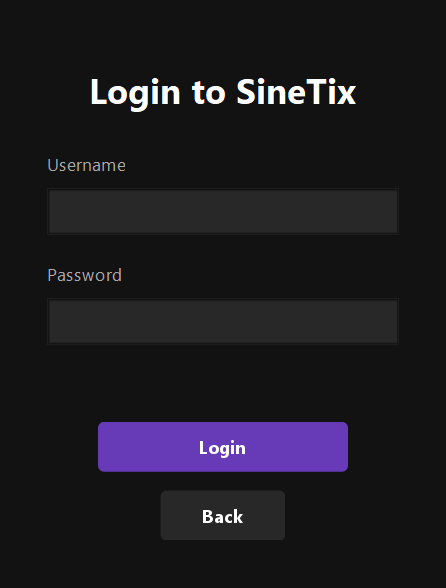
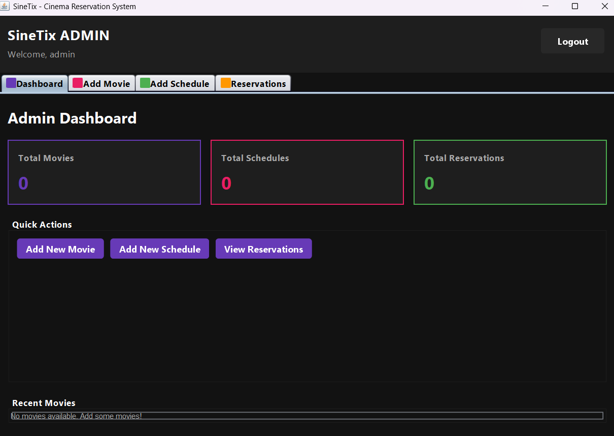
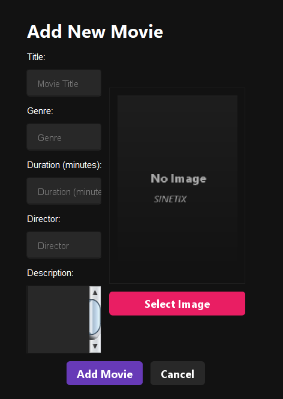
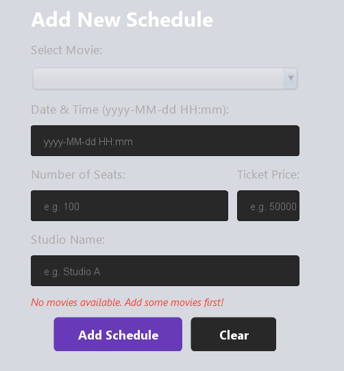
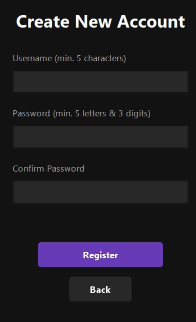
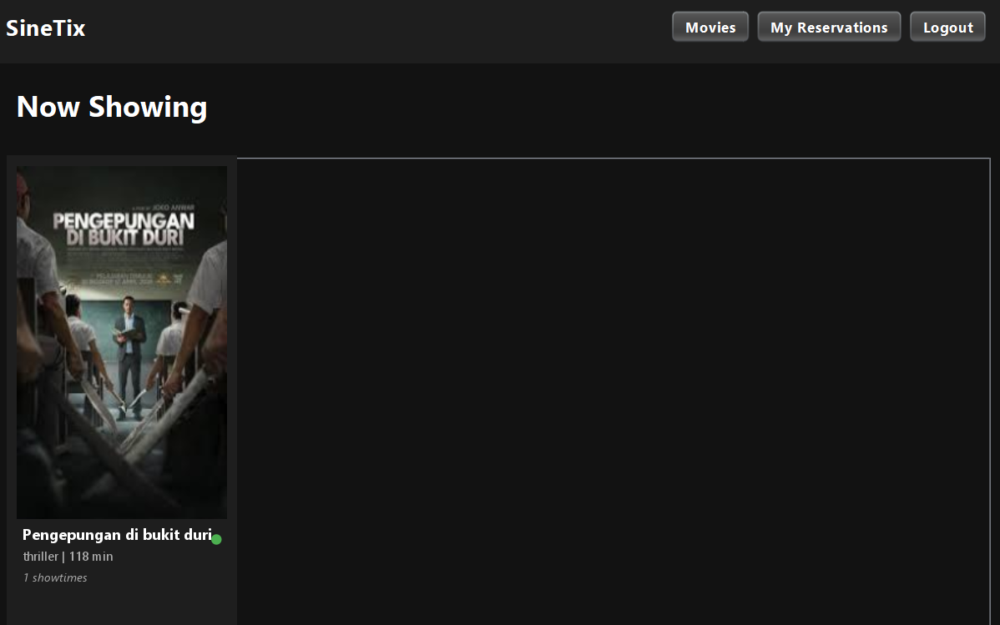
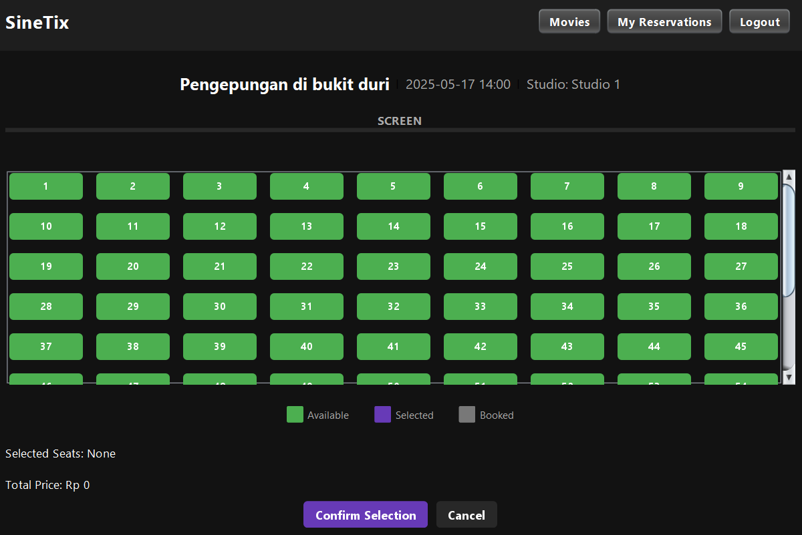
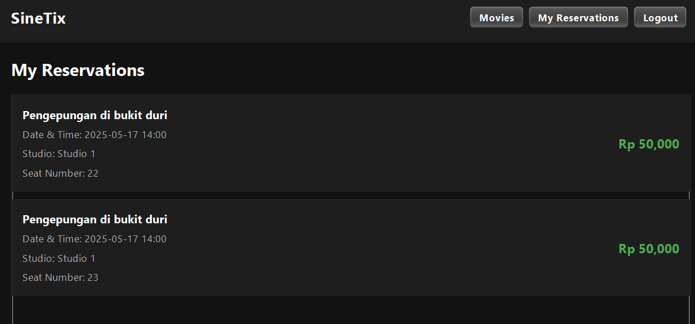

# Cinema Ticketing Application
Sistem Reservasi Tiket Bioskop berbasis Java OOP, aplikasi Java untuk memesan tiket film.

Sistem ini membantu perusahaan yang ingin membuat sebuah bioskop dan membutuhkan aplikasi untuk pemesanan kepada customer serta membantu admin untuk:
- Menambahkan film
- Menambahkan jadwal pada film
- Melihat total orang yang melakukan reservasi pada bioskop

## Fitur

### Admin:
- Dashboard
- Menambah film
- Mengatur jumlah kursi
- Mengatur harga pada sebuah film
- Menghapus film
- Menambah Schedule
- Melihat jumlah reservasi
- Melihat jumlah film yang ada
- Melihat jumlah schedule yang ada
- Melihat jumlah Reservations

### Customer:
- Melihat jumlah film yang ada
- Membeli film yang ingin ditonton
- Memilih kursi yang diinginkan
- Melihat reservasi yang telah dilakukan

## Instalasi
1. Klon repositori ini:
   ```bash
   git clone https://github.com/chxnsa/Cinema-Ticketing-Application.git
2. Jalankan MainGUI.java setelah aplikasi berhasil diimpor.

## Langkah penggunaan
## Login untuk Admin
  Username: admin

  Password: root123

## Tampilan Login


Setelah melakukan Login

## Tampilan Dashboard Admin


## Tampilan Menambahkan Film


fitur yang bisa digunakan
1. Menambahkan film
   - Pilih opsi untuk menambahkan film.
   - Mengisi film :
     Judul: Masukkan judul film.
     Genre: Pilih genre film.
     Durasi: Masukkan durasi film dalam menit.
     Director: Masukkan nama sutradara.
     Deskripsi: Berikan deskripsi singkat tentang film.
     Poster: Upload gambar poster film.

## Tampilan Menambahkan Schedule


2. Menambahkan schedule
   - Pilih film yang ingin ditambahkan jadwalnya.
   - Masukkan informasi berikut:
       Tanggal dan Waktu Mulai: Tentukan tanggal dan waktu film dimulai.
       Jumlah Seat: Masukkan jumlah kursi yang tersedia.
       Harga: Tentukan harga tiket.
       Nama Studio: Tentukan nama studio untuk film tersebut.

3. Melihat reservasi
   - Pilih film untuk melihat jumlah orang yang melakukan reservasi

## Register untuk customer
Pilih opsi untuk register
## Tampilan Register


1. Jalankan aplikasi dan melakukan registrasi
2. Masukkan username dan password yang diinginkan
3. Selamat akun anda berhasil terbuat

## Login untuk customer
1. Masukkan username dan password yang telah diregistrasi

## Tampilan Memilih Film


2. Memilih film
   - Pilih film yang ingin ditonton dari daftar film yang tersedia.

## Tampilan Memilih Jadwal


3. Memilih jadwal
   - Pilih jadwal yang diinginkan dari daftar jadwal yang tersedia.

## Tampilan Memilih Kursi


4. Memilih Kursi:
   - Pilih jumlah kursi yang ingin dipesan.
5. Melakukan Pemesanan:
   - Setelah memilih kursi, lakukan pemesanan. Anda akan melihat konfirmasi pemesanan yang berhasil di bagian My Reservations.

## Tampilan Melihat Reservasi


6. Melihat Reservasi:
   - Di bagian My Reservations, Anda dapat melihat daftar reservasi yang telah Anda lakukan.
  
## Pengujian
Untuk menjalankan aplikasi, buka dan jalankan file MainGUI.java di IDE yang digunakan (misalnya IntelliJ IDEA atau Eclipse).


## Kontak
Ketua

Email: andi.khnisa@gmail.com

Anggota :

Email: azzahrasyam49@gmail.com

Email: isnadiyahnurfadhilah@gmail.com

Email: aal3it@gmail.com

Email: arielmufaddhal1@gmail.com
